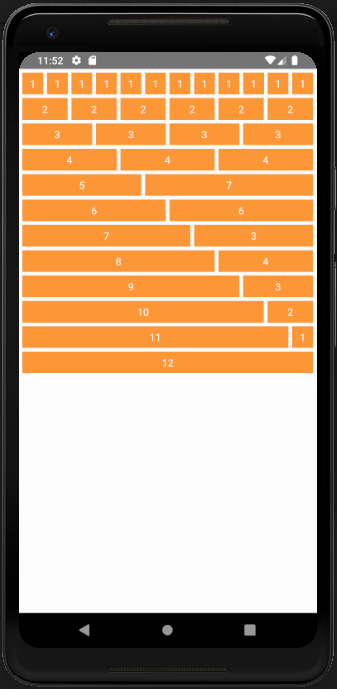
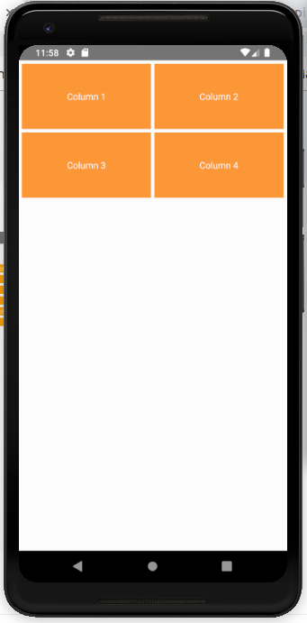
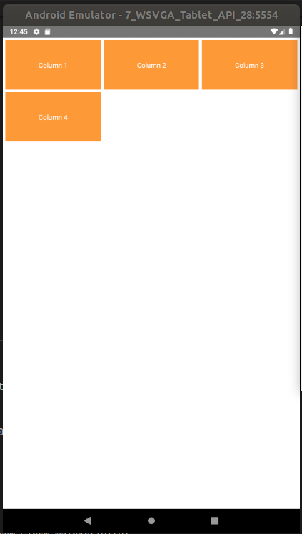
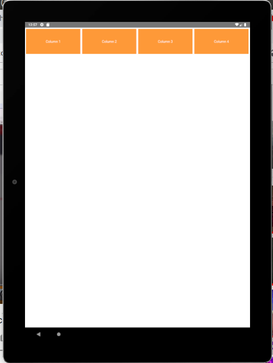

<h3 align="center">
  React native responsive grid system
</h3>

<p align="center">
  This component helps you to create responsive grids in your
  <a href="https://facebook.github.io/react-native/">react-native</a> app design.
</p>
<br />


## Get Started

### Installation
<a href="">npm i react-native-responsive-grid-system</a>


### Usage

<p>Start using the components</p>

```jsx
import { Row, Col } from 'react-native-responsive-grid-system';

<Row>
    <Col xs={} sm={} md={} lg={}>
        Your content goes here
    </Col>
</Row>
```

### Grid
<p align="center">
    <a href="#" target="_blank">
        
    </a>
</p>

## Components included:
  - [Row](#row)
  - [Col](#col)


## How it works
React native grid system uses a series of rows, and columns to layout and align content. It’s built with flexbox and is fully responsive. Below is an example and an in-depth look at how the grid comes together.

### Row
* Rows are wrappers for columns. Each column has padding-right (called a gutter) for controlling the space between them. This padding is then counteracted on the rows with negative margins. This way, all the content in your columns is visually aligned down the left side.

* Row have margin-right to create the gutters, however, you can remove the margin from rows with rowStyles={{ marginRight:0 }} on the Row.

```jsx

    <Row> </Row>

```

### Col
* In a grid layout, content must be placed within columns and only columns may be immediate children of rows.

* Column classes indicate the number of columns you’d like to use out of the possible 12 per row. So, if you want three equal-width columns across, you can use xs={4}, sm={4}, md={4} or lg={4}.

* Column widths are set in percentages, so they’re always fluid and sized relative to their parent element.

* Columns have padding-right to create the gutters between individual columns, however, you can remove the padding from columns with colStyles={{ paddingRight:0 }} on the Col.

* To make the grid responsive, there are 4 grid breakpoints, one for each responsive breakpoint: all breakpoints extra-small (xs), small (sm), medium (md) and large (lg).

```jsx

    <Col xs={} sm={} md={} lg={}> </Col>
    
```

## Customization

### Component Styles ( Row )

```jsx

<Row rowStyles={{ Your custom styles }}> </Row>

```

### Component Styles ( Col )

```jsx

    <Col colStyles={{ Your custom styles }}>
        Your content goes here
    </Col>

```


# Responsive

We design this for multiple screen size. Like <a href="xs">extra small</a>, <a href="sm">small</a>, <a href="md">medium</a> and <a href="lg">large</a> size screen. When you use this component your app UI response you in different screen ( standard size mobile, large-screen mobile, mid-screen tab, and large screen tab )


## Example

```jsx

    <Row>

        <Col xs={6} sm={4} md={3} lg={3}>
            ----
        </Col>

        <Col xs={6} sm={4} md={3} lg={3}>
            ----
        </Col>

        <Col xs={6} sm={4} md={3} lg={3}>
            -----
        </Col>

        <Col xs={6} sm={4} md={3} lg={3}>
            ----
        </Col>

    </Row>
    
```
#### Mobile
<p align="center">
    <a href="#" target="_blank">
        
    </a>
</p>

#### Tab ( small )
<p align="center">
    <a href="#" target="_blank">
        
    </a>
</p>

#### Tab ( big )
<p align="center">
    <a href="#" target="_blank">
        
    </a>
</p>
